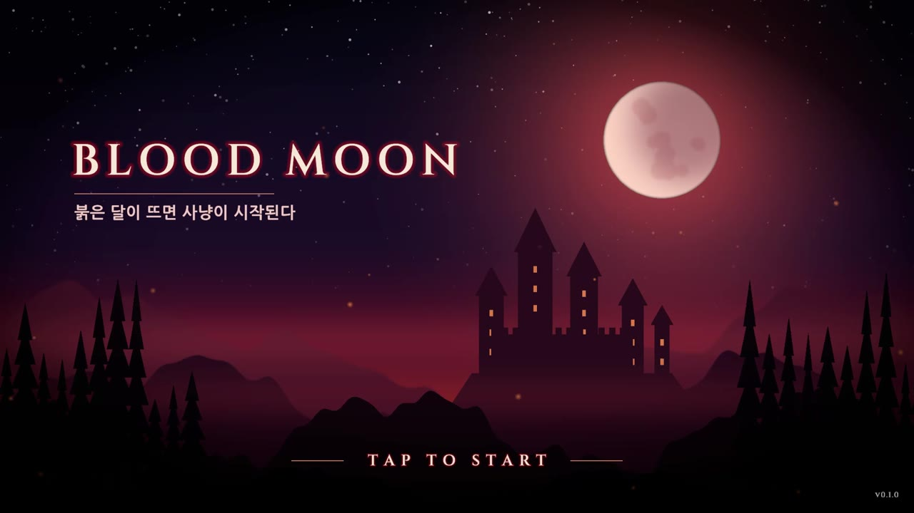
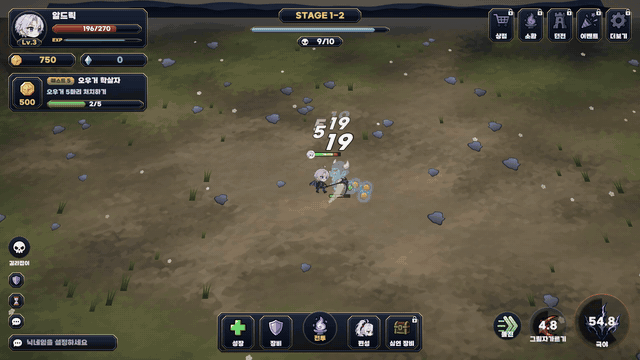
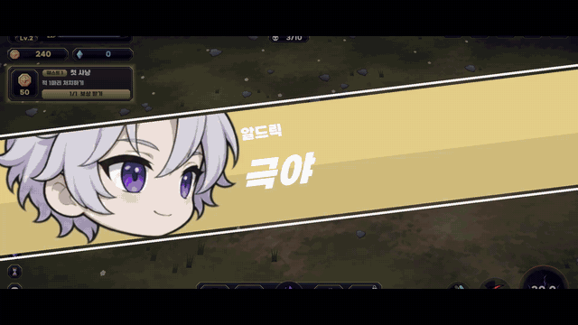
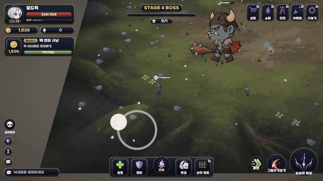
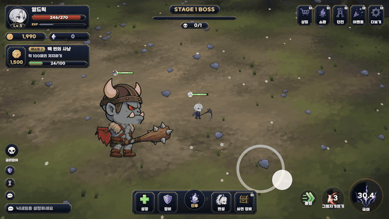
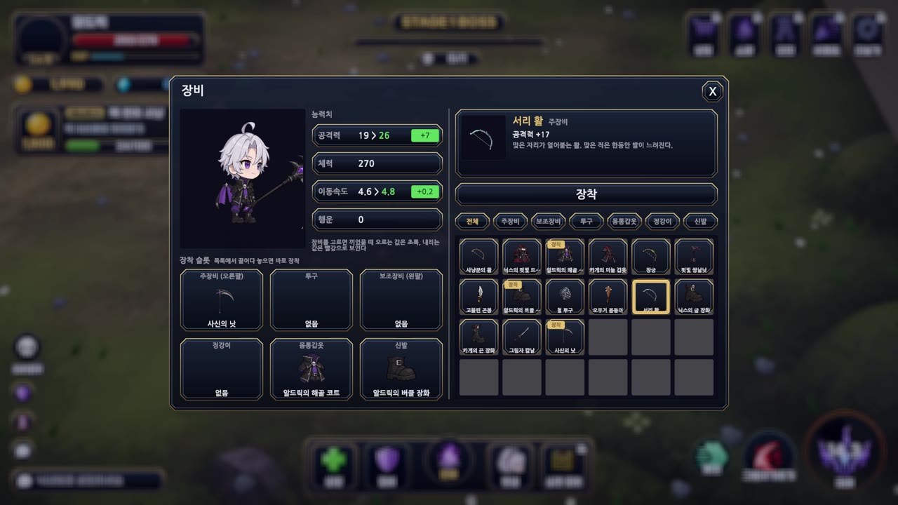
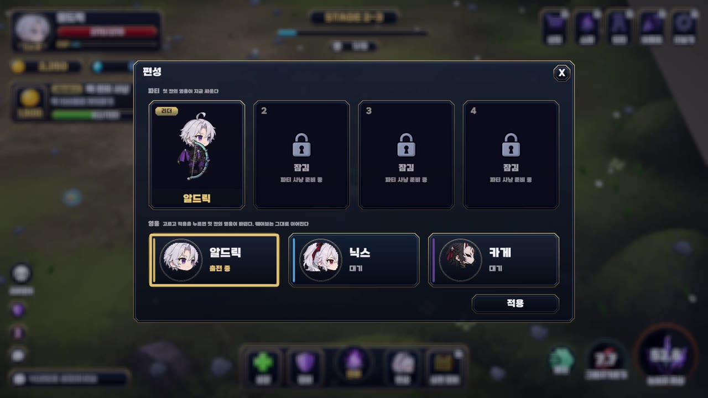
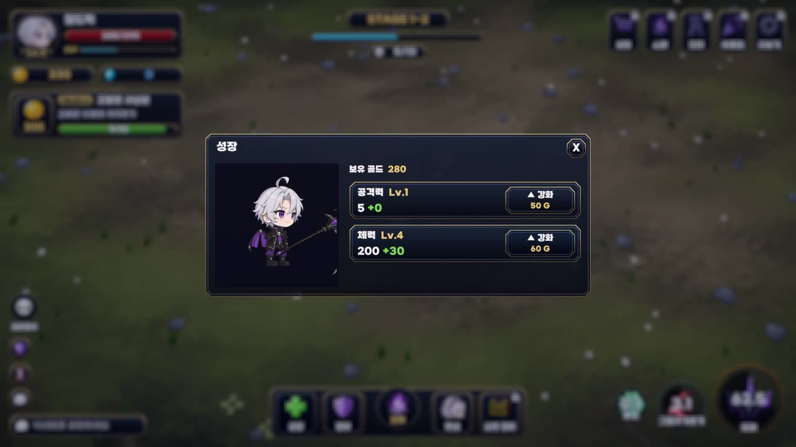

# Blood Moon (가제)

소울헌터 키우기를 오마주한 2D 액션 RPG입니다. 유니티를 연습하려고 만든 습작입니다.

## 플레이

| 전투 | 근접 궁극기 |
|---|---|
|  |  |
| **활 궁극기** | **보스 등장** |
|  |  |

| 장비 | 편성 | 성장 |
|---|---|---|
|  |  |  |

전체 녹화 영상은 [게임영상재료](게임영상재료) 폴더에 있습니다.

## 들어 있는 것

- 반자동 전투: 평타와 스킬은 자동으로 나가고, 조이스틱으로 움직입니다. 조이스틱을 놓으면 가까운 적에게 돌진합니다.
- 궁극기: 컷인, 무대 연출, 타격 순서로 진행됩니다. 무기마다 궁극기가 다릅니다.
- 스테이지와 웨이브, 보스, 퀘스트
- 영웅 셋(알드릭, 닉스, 카게) 편성 교체, 부위별 장비, 골드로 사는 성장

## 사양

| 항목 | 내용 |
|---|---|
| 엔진 | Unity 6000.3.2f1, URP 17.3 |
| 에셋 | Addressables 2.8 |
| 입력 | Input System 1.18 |
| 라이브러리 | UniTask, R3, DOTween |

## 구조

- `UnityProject/GamePractice/Assets/Game`: 게임 코드와 에셋. 기능별 폴더(`Characters`, `Equipment`, `Battle`, `UI` 등)에 코드, 프리팹, 그림을 함께 둡니다.
- `UnityProject/GamePractice/Assets/SayneAssets`: 게임과 상관없이 다시 쓸 수 있는 부품(매니저 기반, 페이즈, HP바, 말풍선 등)
- 매니저는 싱글톤 없이 `GameManager`가 만들어 넘겨 줍니다. 전투에서만 쓰는 매니저는 `BattleScope`로 묶어서, 전투 페이즈가 들어갈 때 만들고 나올 때 정리합니다.

## 실행

Unity 6000.3.2f1로 `UnityProject/GamePractice`를 엽니다. 패키지 설정은 [SETUP.md](SETUP.md)에 있습니다.
